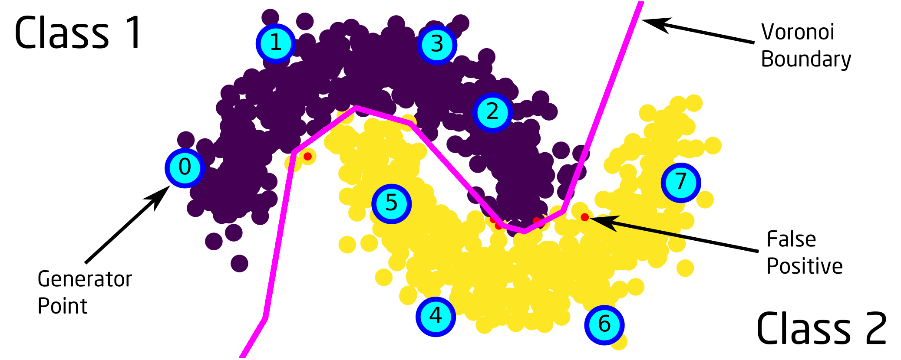

# Super-klust: Another Way of Piecewise Linear Classification

This is the reference implementation of the **Super-klust** algorithm. The
**Super-klust** algorithm is a **Piecewise-Linear (PWL)** classification
algorithm. It generates a set of test points based on the **Voronoi** region
idea, which are called the **generator points**. Then these class labeled test
points can be effectively used for **classification** of an input, in a **SIMD**
fashion. **Inference performance advantage** of the **Super-klust** algorithm
comes from this simplicity.



# Dependencies

## For Super-klust only

- numpy
- sklearn

## To reproduce the results of the paper

- numpy
- sklearn
- matplotlib
- tabulate

# Usage

The interface of the library is made compatible with the Scikit-Learn library.
So, it can be easily tested against any algorithm. The results of the paper can
be reproduced as below.

## Synthetic test plots:

```
python test_moons.py
python test_circles.py
python test_random.py
```

## Generation of tables:

```
python train_validate_test.py
```
